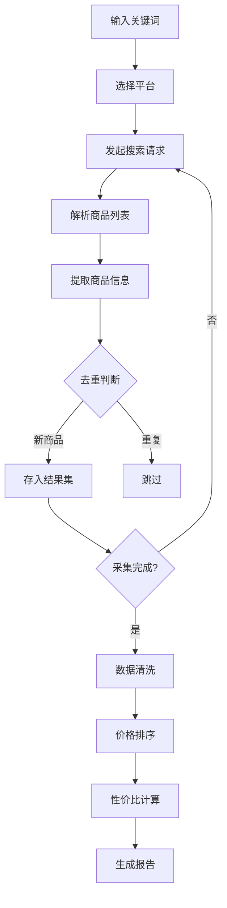
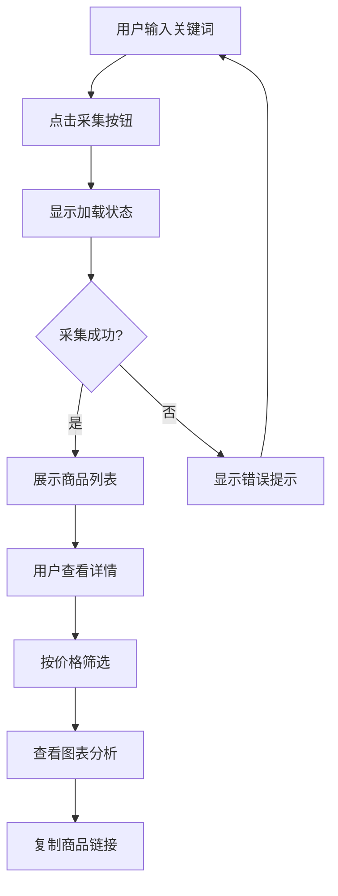
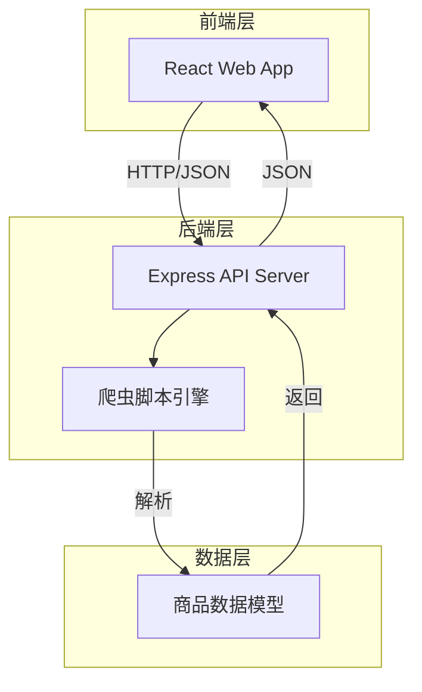
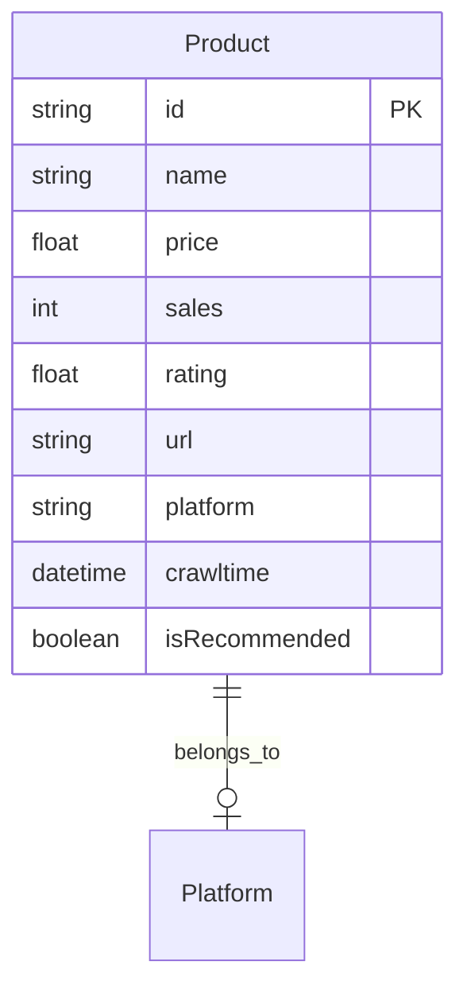

# 电商商品价格采集与对比工具 - 产品需求文档

## 1. 产品概述

**电商价格猎手** - 一款专业的电商商品价格自动化采集与对比工具。

帮助消费者和研究者从京东、淘宝、拼多多等主流电商平台批量抓取商品信息，自动进行价格对比分析，找出最具性价比的商品。

- **目标用户**：购物达人、市场调研人员、价格敏感消费者
- **核心价值**：节省比价时间，发现最优价格，获取购物决策支持

## 2. 核心功能

### 2.1 功能模块

1. **关键词搜索采集**
   - 支持按关键词批量采集商品
   - 可指定采集平台（京东/淘宝/拼多多/全平台）
   - 可设置采集数量上限

2. **商品数据采集**
   - 商品名称
   - 商品价格
   - 销量/成交数
   - 店铺评分
   - 商品链接
   - 平台来源

3. **数据处理与分析**
   - 自动清洗去重
   - 按价格排序（从低到高）
   - 性价比智能推荐标注
   - 价格区间分析

4. **数据可视化展示**
   - 商品对比表格
   - 价格分布图表
   - 性价比排行榜
   - 价格趋势展示

5. **CLI命令行工具**
   - 支持命令行参数配置
   - 输出JSON/CSV格式报告
   - 可集成到其他系统

### 2.2 页面详情

| 页面名称 | 模块名称 | 功能描述 |
|---------|---------|---------|
| 首页 | 搜索区域 | 关键词输入框、平台选择、采集按钮 |
| 首页 | 数据展示区 | 排序后的商品卡片列表 |
| 首页 | 价格图表 | 价格分布柱状图 |
| 首页 | 性价比推荐 | 高性价比商品标记展示 |

## 3. 核心流程

### 3.1 数据采集流程



### 3.2 用户交互流程



## 4. 用户界面设计

### 4.1 设计风格

- **主题**：科技感数据仪表盘风格
- **主色调**：深蓝色 #1a1a2e 作为背景，搭配霓虹青色 #00d4ff 作为强调色
- **按钮风格**：圆角按钮，hover 时有发光效果
- **字体**：JetBrains Mono 用于数据展示，Inter 用于界面文字
- **布局**：单页应用，左侧筛选区，右侧数据展示区

### 4.2 页面设计概述

| 页面名称 | 模块名称 | UI元素 |
|---------|---------|--------|
| 首页 | 搜索栏 | 深色输入框，青色边框，搜索按钮带脉冲动画 |
| 首页 | 商品卡片 | 半透明玻璃态卡片，显示价格/销量/评分 |
| 首页 | 价格图表 | 霓虹色柱状图，hover 显示具体数值 |
| 首页 | 推荐标签 | 金色边框标签，标注"性价比之选" |

### 4.3 响应式设计

- 桌面端：三栏布局（筛选侧边栏 + 商品网格 + 图表面板）
- 平板端：两栏布局
- 移动端：单栏堆叠布局

## 5. 技术架构

### 5.1 技术栈

- **前端框架**：React 18 + TypeScript
- **构建工具**：Vite
- **样式方案**：Tailwind CSS
- **图表库**：ECharts
- **后端**：Express.js（用于运行采集脚本）
- **数据采集**：Puppeteer（无头浏览器）

### 5.2 系统架构



### 5.3 数据模型



## 6. 示例数据

初始化时展示示例商品数据，包含以下字段：

```json
{
  "id": "jd_1001",
  "name": "Apple iPhone 15 Pro 256GB",
  "price": 7999,
  "sales": 25800,
  "rating": 4.9,
  "url": "https://item.jd.com/xxx.html",
  "platform": "京东",
  "crawlTime": "2024-01-15T10:30:00Z",
  "isRecommended": true
}
```
