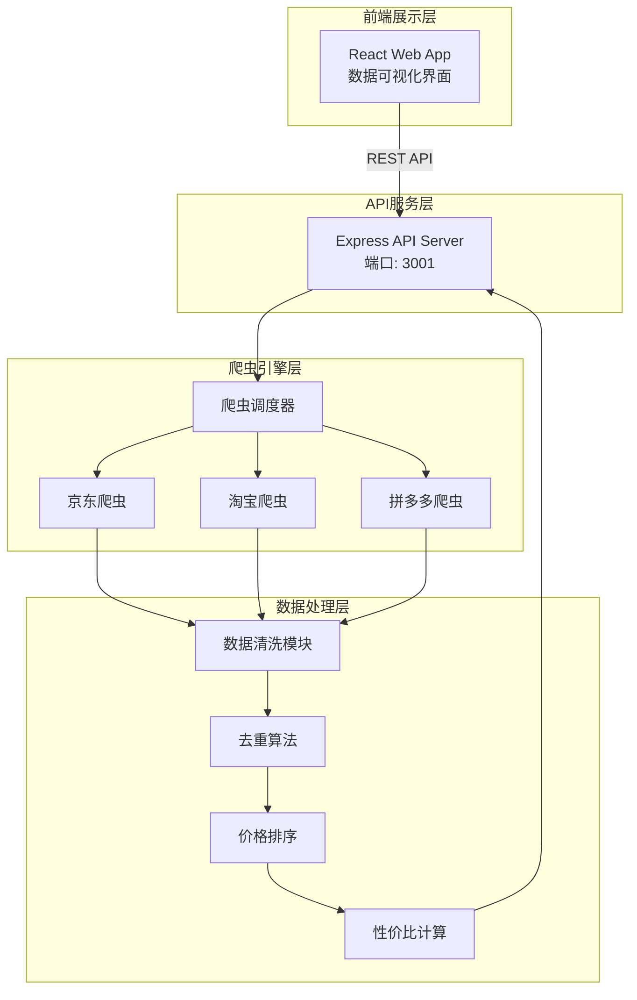
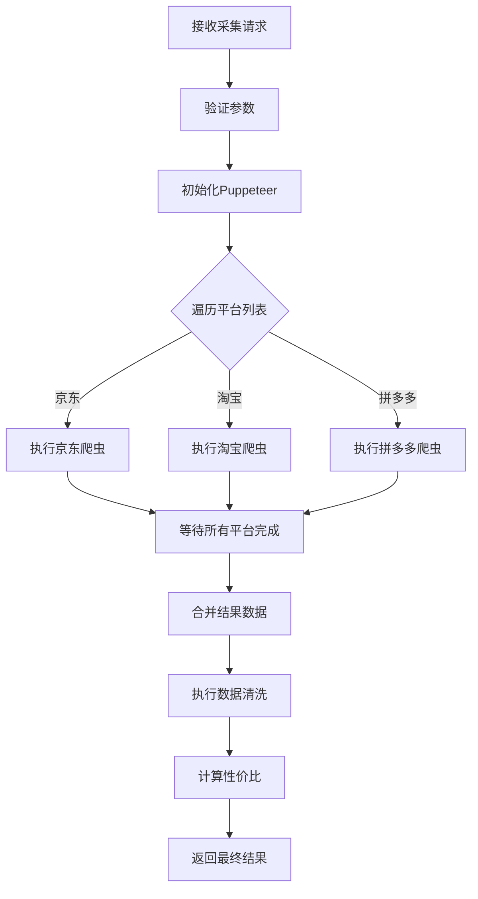

# 电商商品价格采集与对比工具 - 技术架构文档

## 1. 架构设计



## 2. 技术选型

| 层级 | 技术 | 说明 |
|-----|------|-----|
| 前端 | React 18 + TypeScript | 现代化响应式界面 |
| 前端 | Tailwind CSS | 原子化CSS框架 |
| 前端 | ECharts | 数据可视化图表 |
| 前端 | Zustand | 状态管理 |
| 后端 | Express.js | 轻量级API服务 |
| 爬虫 | Puppeteer | 无头浏览器控制 |
| 爬虫 | Cherrio | HTML解析 |

## 3. 目录结构

```
/workspace
├── api/                    # 后端代码
│   ├── server.ts          # Express服务器入口
│   ├── crawler/           # 爬虫模块
│   │   ├── index.ts       # 爬虫调度器
│   │   ├── jd.ts          # 京东爬虫
│   │   ├── taobao.ts      # 淘宝爬虫
│   │   └── pdd.ts         # 拼多多爬虫
│   ├── services/          # 业务逻辑
│   │   ├── product.ts     # 商品数据处理
│   │   └── analytics.ts   # 数据分析
│   └── types/             # 共享类型定义
│       └── index.ts
├── src/                    # 前端代码
│   ├── components/        # React组件
│   ├── pages/             # 页面
│   ├── hooks/             # 自定义Hooks
│   ├── stores/            # Zustand状态
│   └── utils/             # 工具函数
├── cli/                    # CLI命令行工具
│   └── index.ts           # CLI入口
├── package.json
└── vite.config.ts
```

## 4. API定义

### 4.1 采集接口

**POST /api/crawl**

请求参数：
```typescript
interface CrawlRequest {
  keyword: string;      // 搜索关键词
  platforms: string[];  // 目标平台 ["jd", "taobao", "pdd"]
  limit: number;       // 采集数量上限
}
```

响应：
```typescript
interface CrawlResponse {
  success: boolean;
  data: Product[];
  message?: string;
}
```

### 4.2 商品数据结构

```typescript
interface Product {
  id: string;
  name: string;
  price: number;
  sales: number;
  rating: number;
  url: string;
  platform: '京东' | '淘宝' | '拼多多';
  crawlTime: string;
  isRecommended: boolean;
}
```

## 5. 数据采集核心逻辑

### 5.1 爬虫调度器流程



### 5.2 数据清洗规则

1. **去重规则**：
   - 商品名称完全相同 → 去重
   - 商品名称相似度 > 90% → 去重
   - 同一平台同一商品 → 去重

2. **数据标准化**：
   - 价格统一转换为人民币单位
   - 销量统一转换为"万"单位显示
   - 评分统一为5分制

### 5.3 性价比计算算法

```
性价比得分 = (销量 * 0.3 + 评分 * 100 * 0.2) / 价格 * 10
推荐阈值：得分 > 70 标记为推荐商品
```

## 6. CLI工具设计

### 6.1 命令行接口

```bash
price-scraper --keyword "iPhone 15" --platforms jd,taobao --limit 50 --output result.json
```

参数说明：
| 参数 | 说明 | 默认值 |
|-----|------|-------|
| --keyword | 搜索关键词 | 必填 |
| --platforms | 目标平台 | all |
| --limit | 采集数量 | 30 |
| --output | 输出文件路径 | stdout |
| --format | 输出格式 json/csv | json |

## 7. 数据可视化方案

### 7.1 图表类型

| 图表类型 | 用途 | 组件 |
|---------|------|------|
| 柱状图 | 价格分布对比 | PriceDistributionChart |
| 散点图 | 价格-销量关系 | PriceSalesChart |
| 排行榜 | 高性价比商品 | TopProductsList |
| 卡片网格 | 商品列表展示 | ProductCardGrid |

### 7.2 交互设计

- hover 商品卡片：高亮显示详细信息
- 点击商品卡片：弹出详情模态框
- 筛选条件变更：实时更新图表数据

## 8. 错误处理机制

| 错误类型 | 处理方式 |
|---------|---------|
| 网络超时 | 重试3次，间隔2秒 |
| 平台反爬 | 切换User-Agent，降低请求频率 |
| 数据解析失败 | 跳过该商品，记录日志 |
| 无搜索结果 | 返回空数组，提示用户 |
